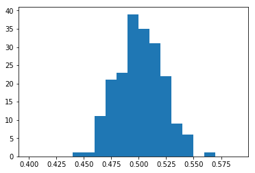
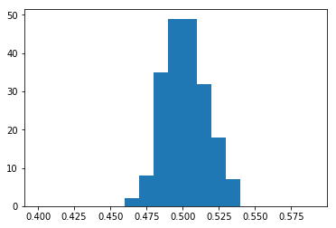
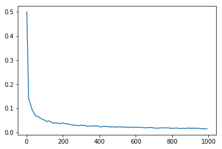
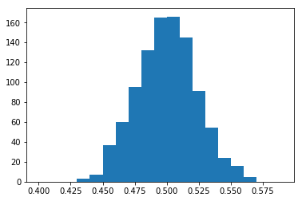
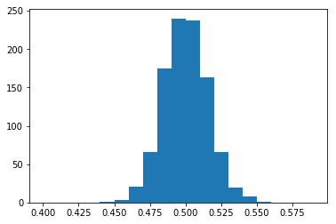
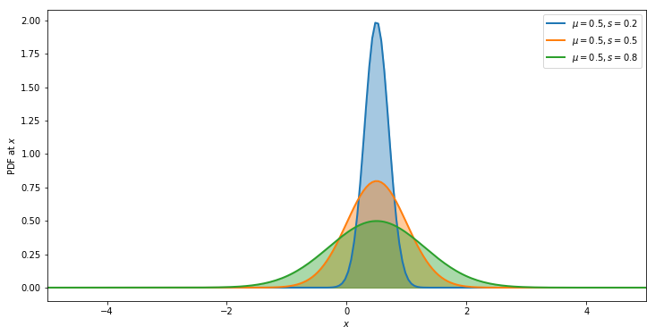
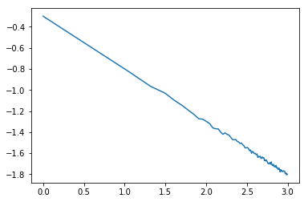

autoscale: true
footer:

---

#[fit] Ai 1

---

##[fit] Probability: Distributions, the MLE, and Elections

---

#Probability

- from symmetry
- from a model, and combining beliefs and data: Bayesian Probability
- from long run frequency

---

#Random Variables

**Definition**. A random variable is a mapping

$$ X: \Omega \rightarrow \mathbb{R}$$

that assigns a real number $$X(\omega)$$ to each outcome $$\omega$$.
- $$\Omega$$ is the sample space. Points
- $$\omega$$ in $$\Omega$$ are called sample outcomes, realizations, or elements.
- Subsets of $$\Omega$$ are called Events.

---

## An example with 2 coin tosses

- E is the event of getting a heads in a first coin toss, and F is the same for a second coin toss.
- $$\Omega$$ is the set of all possibilities that can happen when you toss two coins: {HH,HT,TH,TT}

---

#Fundamental rules of probability:

1. $$p(X) >=0$$;  probability must be non-negative

2. $$0 ≤ p(X) ≤ 1 \;$$

3. $$p(X)+p(X^-)=1 \;$$ either happen or not happen.

4. $$p(X+Y)=p(X)+p(Y)−p(X,Y) \;$$

---

- Say $$\omega = HHTTTTHTT$$ then $$X(\omega) = 3$$ if defined as number of heads in the sequence $$\omega$$.
- We will assign a real number P(A) to every event A, called the probability of A.
- We also call P a probability distribution or a probability measure.

___

## A probabilistic model is:

- A set of random variables,
- A joint probability distribution over these variables (i.e. a distribution that assigns a probability to every configuration of these variables such that the probabilities add up to 1 over all possible configurations).

Now we condition on some random variables and learn the values of others.

(paraphrased from Model Based Machine Learning)

---

## Probability as frequency: throwing darts, uniformly

---

Throwing darts at the wall to find P(A|B). (a) Darts striking the wall. (b) All the darts in either A or B. (c) The darts only in B. (d) The darts that are in the overlap of A and B.

(pics like these from Andrew Glassner's book)

---

# Conditional Probability

conditional probability tells us the chance that one thing will happen, given that another thing has already happened. In this case, we want to know the probability that our dart landed in blob A, given that we already know it landed in blob B.

---

The other conditional...

---

## Joint

Below: the joint probability $$p(A, B)$$, the chance that any randomly-thrown dart will land in both A and B at the same time.

---

## The joint probability can be written 2 ways

---

# Bayes Theorem

Equating these gives us Bayes Theorem.

$$P(A \mid B) P(B) = P(B \mid A) P(A)$$

$$P(A \mid B)  = \frac{P(B \mid A) P(A)}{P(B)}$$

the LHS probability $$P(A \mid B)$$is called the posterior, while P(A) is called the prior, and p(B) is called the evidence

---

## Marginal

$$P(A) = \sum_B P(A, B) = \sum_B P(A \mid B) P(B)$$

$$P(A)$$ is called  the **marginal** distribution of A, obtained by summing or  marginalizing over $$B$$.

---

## Marginal Rule

---

# Marginals and Conditionals, redux

Marginal: 
$$p(X=x_i) = \sum_j p(X=x_i, Y=y_j)$$

Conditional:
$$p(Y = y_j \mid X = x_i) \times p(X=x_i) =  $$

$$p(X=x_i, Y=y_j).$$

---

##[fit] Distributions

---

# Flipping (possibly biased) coins experiment

- flip and catch coin. When you catch it, see whats on palm
- mark `H` for heads, `T` for tails.
- Do it many times. We will see graphs for 491 flips, 982 flips

Now REPEAT the experiment (we'll call each version a **replication**) 200 times

---

## M replications of N coin tosses

---

## 200 replications of N coin tosses

- If the heads are given the value 1 and the tails are given the value 0 then the mean of the sample gives us the fraction of heads in each replication
- these means will be **different**! The fluctuations from one replication to another is called a **distribution**

200 reps, 491 flips per sample -->

---

## what happens if you increase the flips in each sample?

---

## left: 491, right: 982 flips

---

# Properties of this distribution

- We can average this fraction over the replications..a mean of sample means.

- We can also calculate the standard deviation of these means.

What do you expect will be the value of this number for 200 replications of 1 coin toss, 2 toin cosses, and so on?

---

## mean and standard deviation of sample means

---

##[fit] Characterizing
##[fit] Distributions

---

## Cumulative distribution Function

The **cumulative distribution function**, or the **CDF**, is a function

$$F_X : \mathbb{R} → [0, 1] $$,

 defined by

$$F_X (x) = p(X \le x).$$

Sometimes also just called *distribution*.

---

Let $$X$$ be the random variable representing the number of heads in two coin tosses. Then $$x$$ = 0, 1 or 2.

CDF:

---

## Probability Mass Function

$$X$$ is called a **discrete random variable** if it takes countably many values $$\{x_1, x_2,…\}$$.

We define the **probability function** or the **probability mass function** (**pmf**) for X by:

$$f_X(x) = p(X=x)$$

---

The pmf for the number of heads in two coin tosses:

---

## Probability Density function (pdf)

A random variable is called a **continuous random variable** if there exists a function $$f_X$$ such that $$f_X (x) \ge 0$$ for all x,  $$\int_{-\infty}^{\infty} f_X (x) dx = 1$$ and for every a ≤ b,

$$p(a < X < b) = \int_{a}^{b} f_X (x) dx$$

Note: $$p(X=x) = 0$$ for every $$x$$. Confusing!

---

## CDF for continuous random variables

$$F_X (x) = \int_{-\infty}^{x}f_X (t) dt $$

and $$f_X (x) = \frac{d F_X (x)}{dx}$$ at all points x at which $$F_X$$ is differentiable.

Continuous pdfs can be > 1. cdfs bounded in [0,1].

---

### A continuous example: the Uniform(0,1) Distribution

pdf:

$$
f_X (x) =
\begin{cases}
1 & \text{for } 0 \leq x\leq 1\\
    0             & \text{otherwise.}
\end{cases}
$$

cdf:

$$
F_X (x) =
\begin{cases}
0 & x \le 0\\
x & 0 \leq x \leq 1\\
1 & x > 1.
\end{cases}
$$

---

cdf:

---

## Marginals

Marginal mass functions are defined in analog to [probabilities](probability.html):

$$f_X(x) = p(X=x) =  \sum_y f(x, y);\,\, f_Y(y) = p(Y=y) = \sum_x f(x,y).$$

Marginal densities are defined using integrals:

$$f_X(x) = \int dy f(x,y);\,\, f_Y(y) = \int dx f(x,y).$$

---

## Conditionals

Conditional mass function is a conditional probability:

$$f_{X \mid Y}(x \mid y) = p(X=x \mid Y=y) = \frac{p(X=x, Y=y)}{p(Y=y)} = \frac{f_{XY}(x,y)}{f_Y(y)}$$

The same formula holds for densities with some additional requirements $$f_Y(y) > 0$$ and interpretation:

$$p(X \in A \mid Y=y) = \int_{x \in A} f_{X \mid Y}(x,y) dx.$$

^we are conditioning on the event $Y=y$ which strictly speaking has 0 probability
An example of this is the uniform distribution on the unit square. Suppose then that $y=0.3$. Then the conditional density is a uniform density on the line between 0 and 1 at $y=0.3$.

---

## Back to flipping coins: a Probabilistic Model

1. The **true** proportion of heads is $$p$$.
2. Its the same coin you flip each time, where $$p$$ is thus the probability that you get a `H`. This assumption is one of being **Identically Distributed**.
3. Each flip is **Independent** of the other.

Assumptions 2 and 3 taken together are called **IID**, or **Independent and Identially Distributed** Data.

---

#[fit] Frequentist
#[fit] Statistics

---

Answers the question: **What is Data?** with

>"data is a **sample** from an existing **population**"

- data is stochastic, variable
- model the sample. The model may have parameters
- find parameters for our sample. The parameters are considered **FIXED**.
- parameters vary from sample to sample but in real-life we usually only get to see one sample.

---

## Our coin flip example

- in our coins example, the true proportion, called $$p^{*}$$ comes from all possible (infinite) coin flips. We never get to see this
- if we are only given one (finite sample sized) replication, which is the situation in real life, we can only estimate a probability $${\hat p}$$
- in our idealized case where we have many replications, we can now find the **distribution** of estimated probabilities $${\hat p}$$
- but suppose we had only one replication and wanted to find $${\hat p}$$

---

## Likelihood

### How *likely* it is to observe sample with "data" $$k$$ `H` given the parameter $$p$$?

## $$P(X = k \mid n, p) = {n\choose k}p^k(1-p)^{n-k} $$

---

## Likelihood

How likely it is to observe values $$x_1,...,x_n$$ given the parameters $$\lambda$$?

$$
{\cal L}(\lambda) = \prod_{i=1}^n P(x_i | \lambda)
$$

How likely are the observations if the model is true?

Or, how likely is it to observe $$k$$ out of $$n$$ `W`

---

## Maximum Likelihood estimation

---

## Maximum Likelihood

Maximize:

$${\cal L}(\lambda) = \prod_{i=1}^n P(x_i | \lambda)$$

Or since the $$log$$ function is Monotonic, maximize:

$$\ell = log \,{\cal L} = \sum_{i=1}^n log\, P(x_i | \lambda)$$

---

## Binomial Distribution: k Heads in a series of n Flips

$$P(X = k \mid n, p) = {n\choose k}p^k(1-p)^{n-k} $$

$$\ell = log({n\choose k}) + k log(p) + (n-k) log(1-p)$$

$$\frac{d\ell}{dp} = \frac{k}{p}  - \frac{n -k}{1-p} = 0$$ thus $${\hat p}_{MLE} = \frac{k}{n}$$

---

## Point Estimates

We can calculate some quantity of the population, like say the mean, we estimate it on the sample by applying an estimator $$F$$ to the sample data $$D$$, so $$\hat{\mu} = F(D)$$.

If your model describes the true generating process for the data, then there is some true $$\mu^*$$.

We dont know this. The best we can do is to estimate $$\hat{\mu}$$.

Now, in our idealized case we have some M data sets or replications **drawn** from the population, and you can now find $$\hat{\mu}$$ on each such dataset.

So, we'd have M such estimates.

---

## Sampling distribution

As we let $$M \rightarrow \infty$$, the distribution induced on $$\hat{\mu}$$ is the empirical **sampling distribution of the estimator**.

$$\mu$$ could be $$\lambda$$, our parameter $$p$$, or a mean, a variance, etc

We could use the sampling distribution to get confidence intervals on $$\lambda$$.

---

## 1000 ( $$\infty$$) replications of N coin tosses

## left: 491, right: 982 flips

---

## These sampling distributions are Gaussian

$$p(y \vert \mu, \sigma^2) =  \frac{1}{ \sqrt{ 2 \pi \sigma^2}} e^
{-( \frac{y-\mu}{2 \sigma})^2}$$

---

## The Central Limit Theorem (CLT)

Let $$x_1,x_2,...,x_n$$ be a sequence of IID values from a random variable $$X$$. Suppose that $$X$$ has the finite mean $$\mu$$ AND finite variance $$\sigma^2$$. Then:

$$S_n = \frac{1}{n} \sum_{i=1}^{n} x_i ,$$ converges to

$$ S_n \sim N(\mu,\frac{\sigma^2}{n}) \, as \, n \to \infty. $$

---

## log(standard error) vs log(N)

---

## Meaning

- weight-watchers’ study of 1000 people, average weight is 150 lbs with $$\sigma$$ of 30lbs.
- Randomly choose many samples of 100 people each, the mean weights of those samples would cluster around 150lbs with a standard error of 3lbs.
- a different sample of 100 people with an average weight of 170lbs would be more than 6 standard errors beyond the population mean.

---

## The Normal Distribution

We have data on the wing length in millimeters of a nine members of a particular species of moth. We wish to make inferences from those measurements on the population quantities $$\mu$$ and $$\sigma
$$.

Y = [16.4, 17.0, 17.2, 17.4, 18.2, 18.2, 18.2, 19.9, 20.8]

Let us assume a gaussian pdf:

$$p(y \vert \mu, \sigma^2) =  \frac{1}{ \sqrt{ 2 \pi \sigma^2}} e^
{-( \frac{y-\mu}{2 \sigma})^2}$$

---

## MLE Estimators

LIKELIHOOD: $$p(y_1, \ldots, y_n \vert \mu, \sigma^2) =
\prod_{i=1}^{n} p(y_i \vert \mu, \sigma^2)$$

$$=\prod_{i=1}^{n}  \frac{1}{ \sqrt{ 2 \pi \sigma^2}} e^{-( \frac{
(y_i-\mu)^2}{2\sigma^2})} =
\frac{1}{ \sqrt{ 2 \pi \sigma^2}}   \exp \left\{  - \frac{1}{2}  \
sum_i \frac{(y_i-\mu)^2}{\sigma^2} \right\}$$

Take partials for $$\hat{\mu}_{MLE}$$ and $$\hat{\sigma}^2_{MLE}$$

---
[.autoscale: true]

## MLE for Moth Wing

$$\hat{\mu}_{MLE} = \frac{1}{N}\sum_i y_i = \bar{Y};\,\, \hat{\sigma}^2_{MLE}  = \frac{1}{N} \sum_i (Y_i - \bar{Y}^2)$$

VALUES: `sigma 1.33 mu 18.14`

---
[.autoscale: true]

## From Likelihood to Predictive Distribution

- likelihood as a function of parameters is NOT a probability distribution, rather, its a function
- $$p(y \vert \mu_{MLE}, \sigma^2_{MLE})$$ on the other hand is a probability distribution
- think of it as $$p(y^{*} \vert \{y_i\},  \mu_{MLE}, \sigma^2_{MLE})$$ (`norm.rvs` with MLE parameters), "communicating with existing data" thru the parameters
- We'll call such a distribution a predictive distribution for as yet unseen data $$y^{*}$$, or the sampling distribution for data, or the data-generating distribution

---

## Bernoulli Distribution

The distribution for 1 `coin toss` is called the Bernoulli.

Say a coin flip represented as $$X$$, where $$X=1$$ is heads, and $$X=0$$ is tails. The parameter is probability of heads $$p$$.

$$X \sim Bernoulli(p)$$

is to be read as $$X$$ **has distribution** $$Bernoulli(p)$$.

(special case of Binomial for n=1)

---

Bernoulli pmf:

$$
f(x) =
\begin{cases}
1 - p & x = 0\\
p & x = 1.
\end{cases}
$$

for p in the range 0 to 1.

$$f(x) = p^x (1-p)^{1-x}$$

for x in the set {0,1}.

What is the cdf?

---

## Election forecasting

- Each state has a (biased) Bernoulli coin.
- $$p$$ for each state can come from prediction markets, models, polls
- Many simulations for each state. In each simulation:
    - $$rv = Uniform(0,1)$$ If. $$rv < p$$ say Obama wins
    - or $$rv = Bernoulli(p)$$. 1=Obama.

---

## Back to flipping coins: a Probabilistic Model

1. The **true** proportion of heads is $$p_i$$ for the $$i$$th state.
2. Its a different coin you flip each time, where $$p_i$$ is thus the probability that you get a `H` (Democrat). This assumption is NOT one of being **Identically Distributed**.
3. Each flip is **Independent** of the other.

This model is a prototype for Logistic Regression models..

---

## Empirical pmf and cdf

